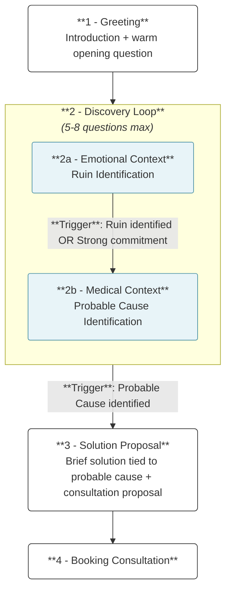
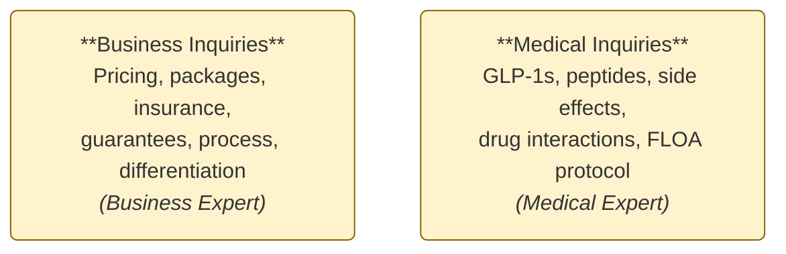
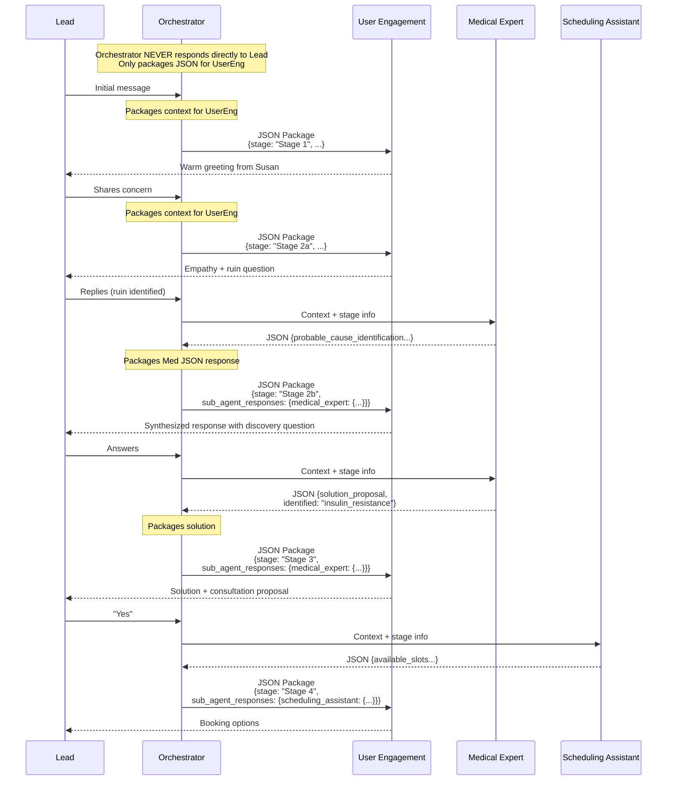
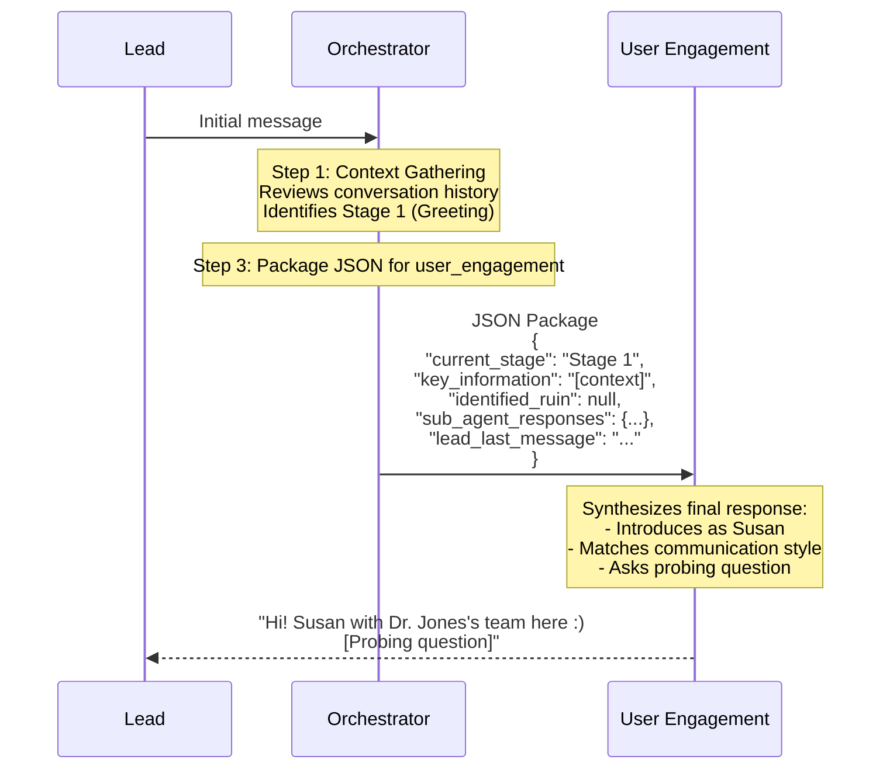
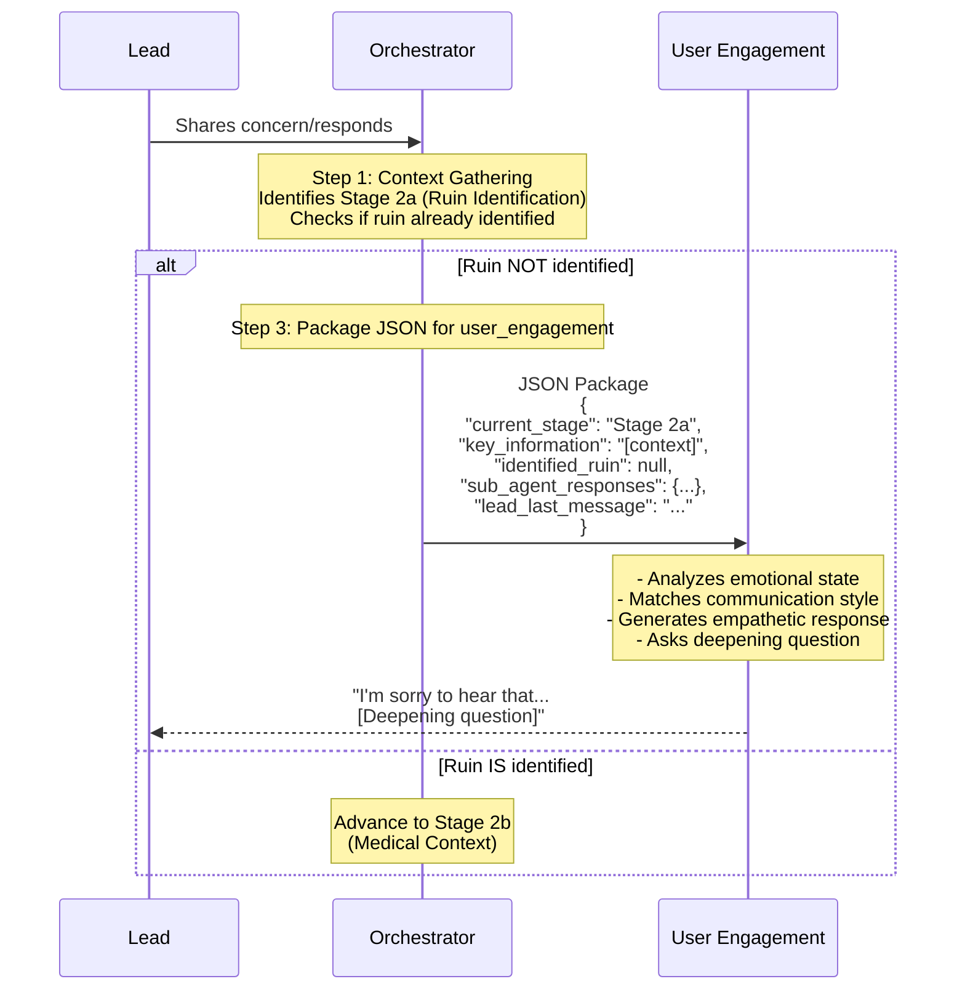
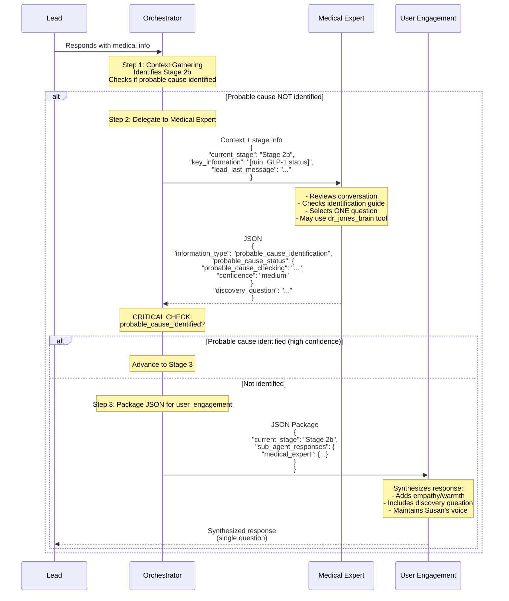
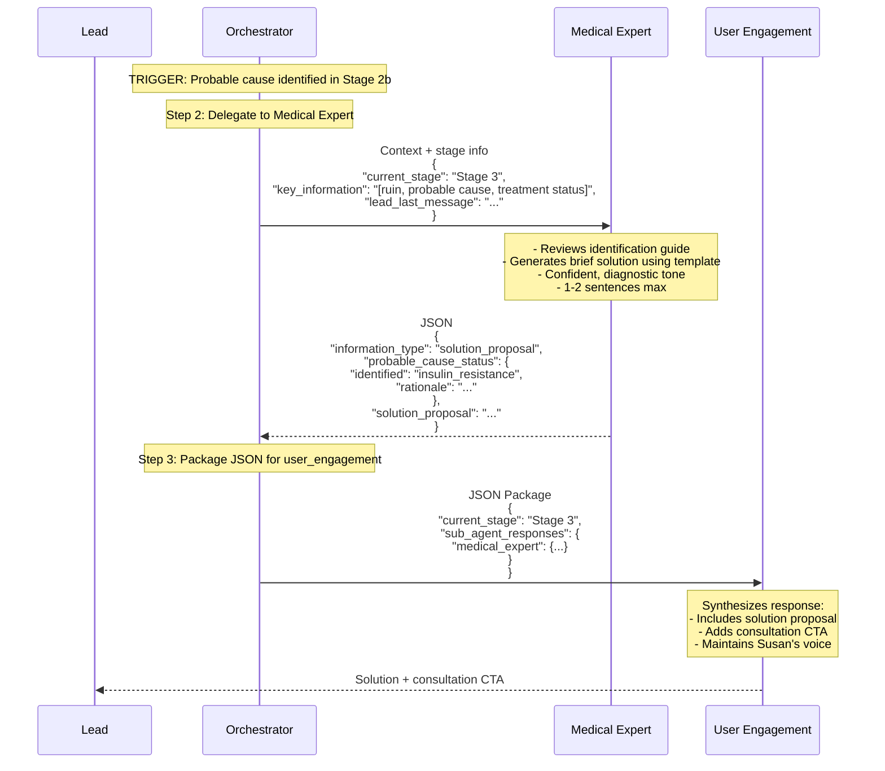
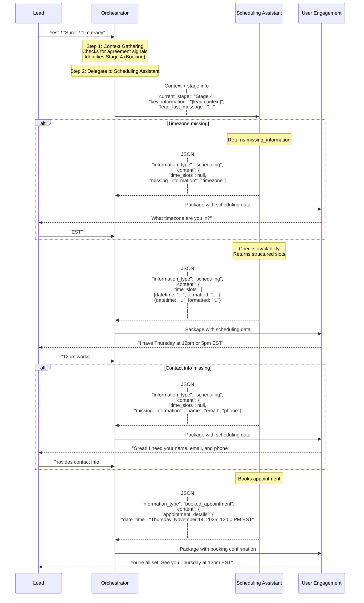
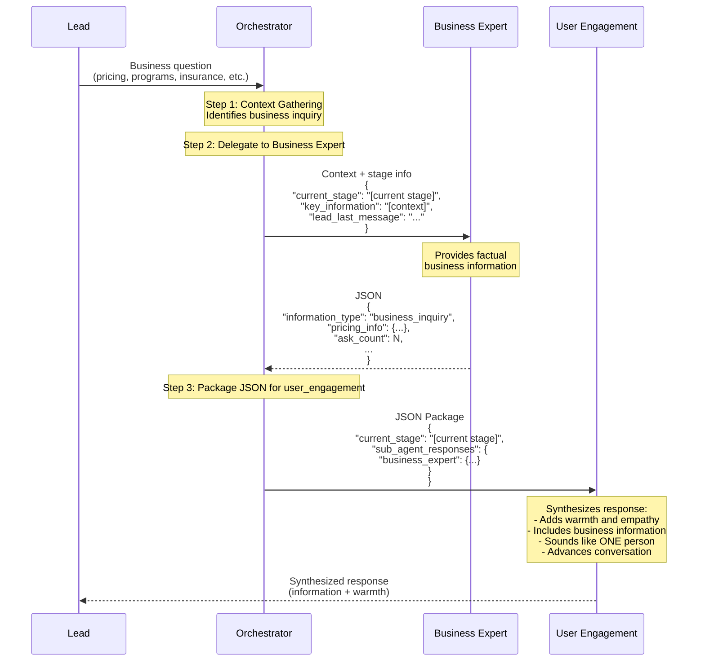
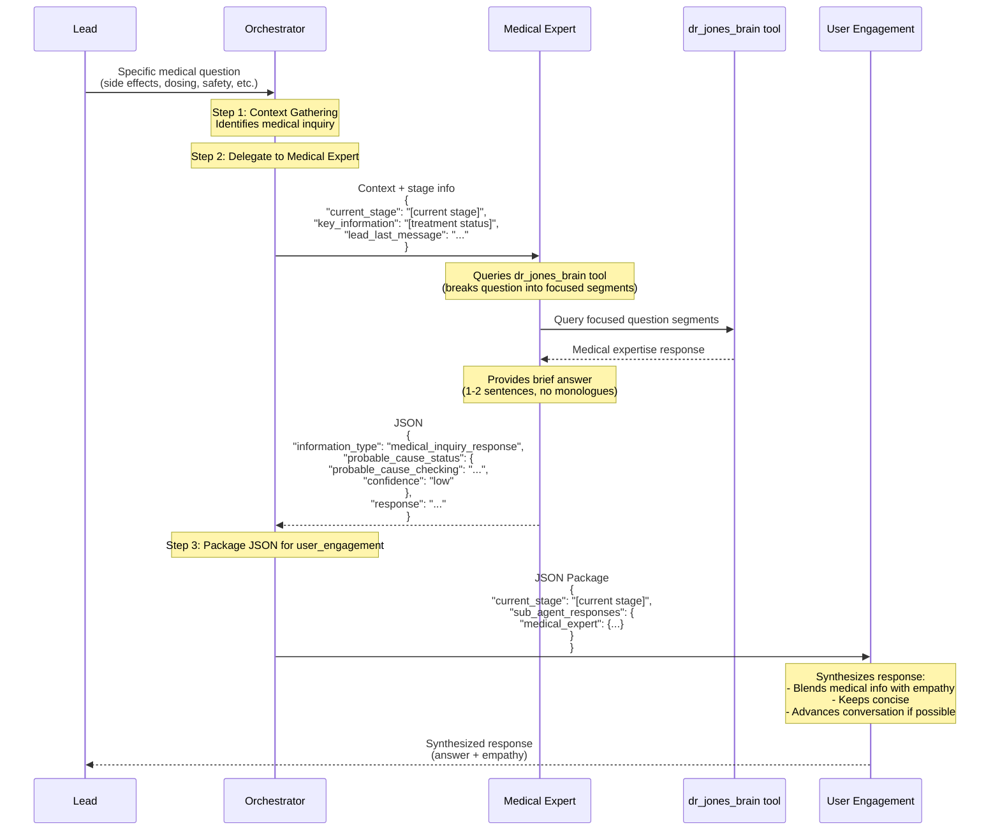

# Agent Overview
**Last Updated**: Oct 30, 2025

Dr. Jones operates a nationwide telemedicine GLP-1/peptide coaching program that combines:
- DC coaching for lifestyle and protocol optimization
- Medical doctor prescriptions for GLP-1s and peptides

This agent is built to engage with Dr. Jones's leads as the call center currently does. The **goal** is to convert leads who never booked, or no-showed to an appointment, into scheduled consultations while providing a genuine, personalized experience.

## Table of Contents
- [1. Conversation Structure](#1-conversation-structure)
  - [1.1 Main Guideline](#11-main-guideline)
  - [1.2 Key Definitions](#12-key-definitions)
  - [1.3 "Side" Conversations](#13-side-conversations)
  - [1.4 Probable Cause Identification Guide](#14-probable-cause-identification-guide)
    - [Assessment Flow](#assessment-flow)
    - [General Context-Gathering Questions](#general-context-gathering-questions)
    - [Eating Pattern Detection](#eating-pattern-detection)
    - [Probable Causes](#probable-causes)
      - [1.4.1 Metabolism Slowdown](#141-metabolism-slowdown)
      - [1.4.2 Medication Desensitization](#142-medication-desensitization)
      - [1.4.3 Hormone Imbalance](#143-hormone-imbalance)
      - [1.4.4 Insulin Resistance](#144-insulin-resistance)
  - [1.5 Special Cases & Escalation Triggers](#15-special-cases--escalation-triggers)
- [2. Technical Implementation](#2-technical-implementation)
  - [2.1 Prompts](#21-prompts)
    - [2.1.1 Orchestrator](#211-orchestrator)
    - [2.1.2 User Engagement](#212-user-engagement)
    - [2.1.3 Medical Expert](#213-medical-expert)
    - [2.1.4 Business Expert](#214-business-expert)
    - [2.1.5 Scheduling Assistant](#215-scheduling-assistant)
    - [2.1.6 Reply Gatekeeper](#216-reply-gatekeeper)
  - [2.2 Sequence Diagrams](#22-sequence-diagrams)
    - [2.2.1 Ideal Conversation Flow](#221-ideal-conversation-flow)
    - [2.2.2 Stage 1: Greeting](#222-stage-1-greeting)
    - [2.2.3 Stage 2a: Emotional Context](#223-stage-2a-emotional-context)
    - [2.2.4 Stage 2b: Medical Context](#224-stage-2b-medical-context)
    - [2.2.5 Stage 3: Solution Proposal](#225-stage-3-solution-proposal)
    - [2.2.6 Stage 4: Booking Consultation](#226-stage-4-booking-consultation)
    - [2.2.7 Business Inquiries](#227-business-inquiries)
    - [2.2.8 Medical Inquiries](#228-medical-inquiries)

## 1. Conversation Structure

### 1.1 Main Guideline
The primary conversation flow consists of four stages. The Discovery Loop expands into two sequential phases that identify both emotional context (ruin) and medical context (probable cause) before proposing a solution.



#### Stage Descriptions:

**Stage 1 - Greeting**
The conversation begins with a warm introduction and an opening question to understand what brought the lead to Dr. Jones.

**Stage 2 - Discovery Loop** *(5-8 questions maximum)*
We learn about the lead's situation through two phases:
- **Stage 2a - Emotional Context (Ruin Identification)**: Understanding what matters most to the lead - their core concern, frustration, or goal. This is their "ruin" - the problem from their perspective.
- **Stage 2b - Medical Context (Probable Cause Identification)**: Asking targeted questions to identify the underlying physiological reason preventing their progress (metabolism, insulin resistance, hormones, or medication desensitization).

**Stage 3 - Solution Proposal**
Once we understand both why it matters to them (ruin) and what's causing it (probable cause), we offer a brief, personalized solution and propose a consultation to discuss details.

**Stage 4 - Booking Consultation**
Scheduling the consultation appointment with available time slots.

**Important Notes:**
- The conversation moves forward through these stages in sequence - **never backwards**
- If a lead shows strong commitment early ("I want to book", "I'm ready"), ruin identification may be skipped, but probable cause must still be identified before proposing a solution
- The entire discovery process is limited to 5-8 questions to keep the conversation focused and efficient

---

### 1.2 Key Definitions

**RUIN**
- **Definition**: A problem from the patient's viewpoint. Must be real TO THEM (not what we think their problem is). It might seem small, but it's their reality.
- **Examples**:
  - "I need to lose 10 lbs"
    - "Tried everything"
    - "Tried for a long time not seeing results"
    - "I have x health issue"
    - "I’m eating a lot less" / "Struggling to eat"
    - "Medication not working despite high dose"
    - "Started gaining weight"
    - "Not being able to lose weight"
    - Any statement of their main concern/fear
    - Might be implicitly stated through a goal. This also counts as ruin identification
- **Stop Signals** (when ruin identification is complete):
  - Lead has provided their ruin
  - Lead shows solution readiness ("What can you do to help me?")
  - Lead becomes defensive or frustrated
  - Commitment signals detected

**STRONG COMMITMENT**
- **Definition**: Indicators that a lead is ready to move forward with the program. When detected, ruin identification can be skipped, but probable cause MUST still be identified. This prevents the agent from trying to book an appointment without context.
- **Examples**:
  - "I want to book an appointment"
  - "How do I get started?"
  - Any form of agreement to meet, or take action.

**Response**: "We can definitely help, we first need to better understand your situation. <discovery question>".

**PROBABLE CAUSE**
- **Definition**: The underlying physiological reason preventing the lead's progress. Must be identified before solution proposal.
- **Four Primary Types**:
  1. **Metabolism slowdown**: Slow metabolic rate affecting weight loss
  2. **Medication desensitization**: Body has adapted to GLP-1 medication, reducing its effectiveness
  3. **Hormone imbalance**: Hormonal issues preventing progress
  4. **Insulin resistance**: Body not responding to insulin properly (often driven by chronic inflammation)

---

### 1.3 "Side" Conversations
These can occur at any point in the main conversation flow and are not necessarily part of the main guideline progression.



---

### 1.4 Probable Cause Identification Guide

This guide helps the medical expert agent identify one of four probable causes during Stage 2b (Medical Context) of the Discovery Loop.

**Section Structure:**
Each probable cause follows this format:
- **Description:** brief explanation of what this cause is and how it affects weight loss
- **Triggers:** symptoms / signals that suggest this probable cause
- **Discovery Questions:** specific questions to ask (ONE at a time)
- **Confirmation Criteria:** when you've confidently identified this cause and should move on to solution proposal.
- **Special Scenarios:** Additional patterns or GLP-1-specific cases (when applicable)

**Critical Rules**:
- Ask only ONE question per response. This rule is important for the AI to stick to the proposed line of questions and avoid getting creative or really verbose with the questioning.
    - **Important**: we want to gather the most information possible whith the fewest interactions as possible. We must not ask simple yes or no questions. The examples used are key for this. To keep the one question per message rule, we can use "bundled" questions like "*Are you currently using a GLP-1 for weight loss, or just starting to explore options?*"
- Once probable cause identified, immediately pivot to solution proposal
- Use the brain tool as a fallback in case no match is found on the guide.

---

#### Assessment Flow
This flow represents probability order, not rigid rules:

**0. Use general context gathering questions when having no context.**

**1. Metabolism Slowdown** (most common)

**2. Medication Desensitization**

**3. Hormone Imbalance**
- **If lifelong struggle** (always struggled with weight) → Default to Insulin Resistance

**4. Insulin Resistance**
- If none of the above clearly fit → Default to insulin resistance + inflammation

---

#### General Context-Gathering Questions
Use these when you have little to no context:

**Broad Discovery**:
- "Are you currently using a GLP-1 for weight loss, or just starting to explore options?"
- "Have you always struggled with weight loss?"
- "How's your energy throughout the day, do you feel tired even after sleeping?"

---

#### Eating Pattern Detection
Probable cause identification strongly relies on detecting the eating pattern of the lead. Here's how to identify undereating or overeating:

**Undereating** (inferred from):
- Struggling to eat
- Eating changed due to medications
- Small portions

**Overeating / No Appetite Suppression** (inferred from):
- Reports hunger at high dose
- Lead says they are eating a lot
- Mentions carbs, junk food.
- Mentions cravings, "food noise", no control.
- Large intake despite medication

**Ambiguous Cases**: ask clarifier: "Do you ever feel like you have to push yourself to eat, or do you feel hungry throughout the day?"

---

#### Probable Causes

---

#### 1.4.1 Metabolism Slowdown

**Description:**
Slow metabolic rate affecting weight loss, often from prolonged undereating or very low-calorie diets.

**Triggers:**
- Weight won't budge despite eating less
- Undereating, low calories, cannot eat, struggle to eat
- Not eating enough, eating less than before, hard time eating
- History of low-calorie diets
- Always feeling cold
- Low energy
- Hair loss
- Brain fog

**Discovery Questions** (ask ONE at a time):
- "How's your eating been lately?"
- "Do you feel like you're eating significantly less than before?"
- "Do you feel cold often, or have low energy?"

**GLP-1-Specific Scenarios:**

**Scenario A: Appetite Suppression → Metabolic Crash**
- Trigger: Very low appetite, barely eating
- Calorie Thresholds: Female <1500 cal / Male <1700 cal = metabolism slowed
- Response: Address extreme undereating, metabolism slowed, body holding onto fat

**Confirmation Criteria:**
- Undereating or very low calories confirmed (<1500 cal female / <1700 cal male) AND
- Metabolic adaptation symptoms present (cold, low energy, hair loss, brain fog) AND
- Weight loss stalled despite eating less

---

#### 1.4.2 Medication Desensitization

**Description:**
Body has adapted to GLP-1 medication over time, reducing its effectiveness. This happens when someone has been on the medication for extended periods.

- **Long time**: More than 3 months on medication

**Triggers:**
- Been on the medication for a long time (>3 months)
- No results despite being on medication
- Medication stopped working
- No appetite suppression anymore
- Carb/sugar cravings


**Discovery Questions**:
- "What dose are you currently on?"
- "How long have you been on this medication?"
- "What does a typical day of eating look like for you?"

**GLP-1-Specific Scenarios:**

**Scenario A: Been on the medication for a long time + Undereating → Medication Desensitization**
- Trigger: Been on the medication for a long time + Undereating + no results
- Response: Your body has adapted to the medication, we need to re-sensitize

**Scenario B: Been on the medication for a long time + Overeating → Loss of Appetite Suppression**
- Trigger: Been on the medication for a long time + still hungry/overeating + no appetite suppression
- Response: Your body has adapted to the medication, mention "we have an amazing fat mobilizing peptide"

**Confirmation Criteria:**
- Been on the medication for a long time + no results OR
- Long duration on medication + diminishing effectiveness OR
- Been on the medication for a long time + loss of appetite suppression

---

#### 1.4.3 Hormone Imbalance

**Description:**
Hormonal issues preventing progress (thyroid, sex hormones, reproductive hormones).

**Triggers:**
- Fatigue
- Mood changes
- Weight gain (especially if wasn't always overweight)
- Started gaining weight recently, not a life-long issue.
- No changes to lifestyle but still began to gain weight
- Low motivation or libido

**Discovery Questions**:
- Have you always struggled with weight loss or was it just in the recent years?

For Women:
- "Any hot flashes, night sweats, or mood changes that could be hormone-related?"

For Men:
- "Any changes in your sex drive, motivation, or feeling less confident than you used to?"

For All:
- "Have you ever been told you have thyroid issues, even if your doctor said you're 'in normal range'?"

**Confirmation Criteria:**
- Specific hormone symptoms (hot flashes, low libido, mood changes) OR
- Previous thyroid diagnosis OR
- Weight gain after getting older OR
- Weight gain after childbirth 

---

#### 1.4.4 Insulin Resistance

**Description:**
Body not responding to insulin properly, keeping body in fat-storing mode. Often caused or worsened by chronic inflammation.

**Triggers:**
- Always struggled with weight loss (lifelong pattern)
- Energy crashes after meals
- Family history of diabetes
- PCOS or insulin-related autoimmune conditions
- Body aches
- Joint pain
- Prediabetic OR type II diabetic

**Discovery Questions**:
- "Do you experience energy crashes, especially after meals?"
- "Do you tend to crave carbs or sugars?"
- "Any family history of diabetes or prediabetes?"
- "Do you notice general body aches, swelling, or feeling inflamed?"

**Special Patterns:**

**Lifelong Weight Struggle**
- Trigger: "Always struggled with weight loss"
- Immediate Response: Identify likely insulin resistance, ask about easy weight gain
- No need for further discovery questions

**Inflammatory Pattern**
- Trigger: Body aches, joint pain, autoimmune conditions
- Assessment: Chronic inflammation driving insulin resistance
- Note: Inflammation and insulin resistance frequently occur together

**PCOS / Autoimmune Conditions**
- Trigger: PCOS, Hashimoto's, or other autoimmune conditions
- Response: PCOS strongly linked to insulin resistance, discuss GLP-1s
- Apply same logic to all insulin-related autoimmune conditions

**Confirmation Criteria:**
- Lifelong struggle + easy weight gain OR
- Energy crashes + cravings OR
- PCOS/autoimmune diagnosis OR
- Chronic body aches/swelling

---

### 1.5 Special Cases & Escalation Triggers

This section covers scenarios requiring human intervention in the call center system.

#### Overview

When certain triggers are detected during conversation, the Human Escalator agent classifies the situation and determines if human intervention is required.

#### Classification System

The Human Escalator returns structured JSON:

```json
{
  "classification": "service_interest" | "critical_escalation" | "no_action",
  "service_type": "bhrt" | "healing_peptides" | "cognitive_peptides" | "growth_hormone_peptides" | "international_lead" | null,
  "critical_type": "medical_emergency" | "safety_concern" | "severe_reaction" | "technical_issue" | "underage" | "parent_inquiry" | null,
  "reasoning": "string",
  "template_handoff": "string" | null,
  "requires_handoff": true | false
}
```

**Schema Rules**:
- `classification`: use `critical_escalation` for emergencies/safety/technical/minor cases, `service_interest` when a specialty service needs human follow-up, and `no_action` when neither condition applies
- `service_type`: only populate when classification is `service_interest`, otherwise set to `null`
- `critical_type`: only populate when classification is `critical_escalation`; use `null` otherwise
- `reasoning`: summarize why you made this classification (1-2 sentences max)
- `template_handoff`: provide the exact template string from approved templates when classification is `service_interest` or `critical_escalation`; set to `null` for `no_action`
- `requires_handoff`: `true` whenever a human needs to intervene, `false` only when classification is `no_action`

#### Service-Based Escalations

These occur when leads request services outside the standard weight loss/GLP-1 program:

##### 1. BHRT (Bioidentical Hormone Replacement Therapy)
**Trigger when lead mentions:**
- "low testosterone", "hormone replacement", "testosterone therapy"
- Any direct BHRT mention
- References to hormone pellets or pellet therapy

Escalate whenever these intents appear and send the BHRT template handoff.

**No Escalation Required Tag**: Mentions of "hormones" in a general GLP-1/weight-loss context without explicit BHRT or pellet requests should remain `no_action`.

##### 2. Healing Peptides
**Trigger when lead mentions:**
- "injury recovery", "healing", "therapeutic peptides"
- "joint pain" that is unrelated to weight loss efforts
- Specific compounds: BPC-157, TB-500, Wolverine stack, or requests to speed up musculoskeletal recovery

Escalate whenever these intents appear and send the Healing Peptides template handoff.

**No Escalation Required Tag**: Typical soreness from workouts, plateaus, or "healing metabolism" during weight loss is not a healing-peptide cue; keep as `no_action`.

##### 3. Cognitive Peptides
**Trigger when lead mentions:**
- "memory", "focus", "cognitive enhancement"
- NAD or NAD+ protocols

Escalate whenever these intents appear and send the Cognitive Peptides template handoff.

**No Escalation Required Tag**: Leads referencing energy, focus, or brain fog solely as GLP-1 side effects or weight-loss struggles stay in `no_action`.

##### 4. Growth Hormone Peptides
**Trigger when lead mentions:**
- "anti-aging", "muscle building", "growth hormone", "HGH"
- Skin elasticity concerns ("saggy skin") or body recomposition goals
- Compounds such as CJC, Sermorelin/Semorelin (misspellings included), Tesamorelin

Escalate whenever these intents appear and send the Growth Hormone Peptides template handoff.

**No Escalation Required Tag**: Weight-loss-driven body composition or toning questions without HGH-specific language stay in `no_action`.

##### 5. International Lead
**Trigger when lead mentions:**
- Location outside the United States (country names, "I'm in [non-US location]")
- Weight units in KG or Stone (non-US measurement systems)
- References to not being able to receive US shipments

Escalate whenever these intents appear and send the International Lead template handoff.

**No Escalation Required Tag**: US-based leads or leads who haven't indicated their location should remain `no_action`.

#### Critical Escalations

These require immediate human intervention for safety or technical reasons.

Immediately flag a human operator and use the appropriate template whenever you detect:

- **Medical emergencies**: "can't breathe", "chest pain", "passing out", ambulance references
- **Severe medication reactions**: concerning side effects that require a medical provider
- **Safety concerns**: suicidal ideation, self-harm language, threats toward others
- **Persistent technical errors**: repeated complaints that forms, payment links, or calendars are broken
- **Under 18 leads**: any mention of the lead being younger than 18, with or without parental involvement
- **Parents asking about their children**: we need direct consent from the child; escalate for manual handling

#### Sub-Agent Hand-offs

These occur when specialist agents lack information to fully answer questions:

- **Medical Expert Hand-offs**: When `dr_jones_brain` tool doesn't provide actionable answer for medical questions, the medical expert sets `hand_off_required: true` in its JSON response
- **Business Expert Hand-offs**: When `product_catalog` or knowledge base lacks requested information (promotions, specific product details), the business expert sets `hand_off_required: true` in its JSON response

#### Approved Handoff Templates

##### Service Interests

**BHRT, Healing Peptides, Cognitive Peptides, Growth Hormone Peptides:**
```
Thank you for letting me know you are insterested in learning more about [service_label], we will get back to you first thing tomorrow morning
```

**International Lead:**
```
We can't ship meds outside the U.S., but we do coach clients all over the world. Coaching is actually the most powerful part of our program: weekly check-ins, unlimited support, and even a results guarantee in our top tier. I'll have someone reach out with more details :)
```

##### Critical Escalations

**Medical Emergency** (can't breathe, chest pain, similar):
```
I'm so sorry you're going through this. We are not equipped to handle emergencies over text. Please contact your prescribing provider or emergency services right away.
```

**Severe Medication Reaction:**
```
I'm so sorry you're experiencing that. We aren't able to help with severe reactions over text, so please reach out to your prescribing provider or emergency services immediately.
```

**Safety Concern** (suicidal, self-harm):
```
I hear how serious this feels. Please reach out to emergency services or the 988 Lifeline immediately so you can get help right now.
```

**Persistent Technical Issue:**
```
Thanks for flagging the issue. I'm escalating this right now so we can fix it and follow up directly.
```

**Underage:**
```
Thanks for reaching out. We need the patient to contact us directly so we have their consent. I'll follow up to explain the next steps.
```

**Parent Inquiry About Child:**
```
Thanks for letting me know. We need the patient to contact us directly so we have their consent before sharing details. I'll reach out with instructions.
```

---

# 2. Technical Implementation

## 2.1 Prompts

#### 2.1.1 Orchestrator

**Role**: Intelligent conductor coordinating all specialized sub-agents, managing conversation flow, and packaging their JSON responses for the user_engagement agent.

**Main Responsibilities**:
- Analyzes conversations and delegates to specialist sub-agents (medical_expert, business_expert, scheduling_assistant)
- Manages conversation flow through the 4-stage guideline
- Packages structured JSON responses from sub-agents with conversation context
- Outputs packaged data to user_engagement agent, which generates the final conversational response

**Key Tasks**:
1. **Context Gathering**: Reviews conversation history, identifies current stage, notes treatment status, identifies ruin
2. **Sub-Agent Delegation**: Routes requests to appropriate specialists based on conversation needs, providing them with stage and context
3. **Response Packaging**: Packages all sub-agent JSON outputs with conversation metadata into a structured format for user_engagement
4. **Conversation Progression**: Advances leads through stages (Greeting → Discovery → Solution → Booking) based on stage progression triggers

**Prompt Structure (XML Tags)**:
```xml
<role>
  Define orchestrator's coordination role
  <context>
    Dr. Jones program context

<definitions>
  <ruin>
    <ruin_examples>

<conversation_guideline>
  4-stage conversation flow (Greeting → Discovery Loop → Solution Proposal → Booking)

<task>
  <step_1_context_gathering>
    Context gathering instructions
  <stage_progression_detection>
    Stage transition trigger detection
  <step_2_sub_agent_delegation>
    Sub-agent delegation strategy
    <sub_agent_prompt_format>
      Format for calling sub-agents
  <step_3_final_response>
    Response packaging instructions
    <final_response_format>
      JSON output schema
```

**v2.0 Output Format (Structured JSON)**

The orchestrator outputs a structured JSON package containing conversation state and all sub-agent responses:

```json
{
  "current_stage": "Stage 1" | "Stage 2a" | "Stage 2b" | "Stage 3" | "Stage 4",
  "key_information": ["Factual bullet point 1", "Factual bullet point 2"],
  "identified_ruin": ["Identified ruin"],
  "sub_agent_responses": {
    "medical_expert": {JSON object from medical_expert} | null,
    "business_expert": {JSON object from business_expert} | null,
    "scheduling_assistant": {JSON object from scheduling_assistant} | null
  },
  "lead_last_message": "string - the lead's most recent message"
}
```

**Field Descriptions**:
- `key_information`: Array of factual bullet points about the lead (no agent goals or instructions)
- `identified_ruin`: Array containing the identified ruin(s) from the lead's perspective
- Both fields are arrays of strings for structured data handling

**Key Points**:
- Sub-agent responses are included as-is (never modified)
- All received sub-agent responses must be included
- The user_engagement agent receives this package and handles all synthesis

---
#### 2.1.2 User Engagement

**Role**: Emotional intelligence specialist and primary communicator ensuring leads feel heard and genuinely cared for.

**Main Responsibilities**:
- Emotional intelligence and sentiment detection
- Building rapport and trust through authentic connection
- Mirroring lead communication styles
- Ruin identification (discovering the lead's core problem)
- Maintaining engagement throughout conversation flow

**Prompt Structure (XML Tags)**:
```xml
<goal>
  Define emotional intelligence specialist role

<agent_identity>
  Susan identity and introduction rules

<definitions>
  <ruin_examples>
  <arc_framework>
    ARC Triangle Framework

<sentiment_detection_framework>
  Identify emotional states

<communication_style_matching_guide>
  Match lead's communication style

<conversation_guideline>
  Role in 4-stage flow
  <your_scope>

<empathy_guide>
  Acknowledging struggles appropriately

<prohibited_patterns>
  Behaviors to avoid

<treatment_status_templates>
  Response templates by GLP-1 status

<trust_building>
  Connection techniques

<task>
  <step_1_context_gathering>
  <step_2_response_generation>
```

**v2.0 Input/Output Format**

**Input Format**: User engagement receives a JSON package from the orchestrator containing:

```json
{
  "current_stage": "Stage 1" | "Stage 2a" | "Stage 2b" | "Stage 3" | "Stage 4",
  "key_information": ["Factual bullet 1", "Factual bullet 2"],
  "identified_ruin": ["Identified ruin"],
  "sub_agent_responses": {
    "medical_expert": {...} | null,
    "business_expert": {...} | null,
    "scheduling_assistant": {...} | null
  },
  "lead_last_message": "string - the lead's most recent message"
}
```

**Output Format**: Conversational text (not JSON) - warm, personalized responses that synthesize sub-agent data into natural conversation

**Key Points**:
- User engagement is the ONLY agent that outputs conversational text (all other agents output JSON)
- Receives structured data from orchestrator and transforms it into warm, empathetic responses
- Synthesizes multiple sub-agent responses into a single, cohesive message from "Susan"
- Applies sentiment detection, communication style matching, and empathy guidelines
- Reviews entire conversation history to maintain continuity and vary language

---

#### 2.1.3 Medical Expert

**Role**: Clinical expert providing warm, confident authority on treatment and medical matters.

**Main Responsibilities**:
- Provides clinical and treatment-related expertise
- Identifies probable causes (underlying physiological reasons)
- Delivers solution proposals tied to identified causes
- Answers specific medical questions about peptides, GLP-1s, dosing, side effects

**Prompt Structure (XML Tags)**:
```
<goal>
  Define clinical expert role

<medical_expertise_areas>
  List expertise domains

<definitions>
  <probable_cause>
    4 probable causes

<conversation_guideline>
  Role in 4-stage flow
  <scope>

<tools>
  <dr_jones_brain_tool>
  <product_catalog_tool>

<probable_cause_identification_guide>
  Comprehensive identification guide

<prohibited_patterns>
  Behaviors to avoid

<task>
  <step_1_context_gathering>
  <step_2_answer>
    <information_sources_when_answering>
    <probable_cause_identification>
    <solution_proposal>
      <solution_proposal_template>
        <solution_proposal_examples>
  <step_3_answer_evaluation>
  <step_4_output_format>
    <output_format>
```

**Tools**:
- `dr_jones_brain`: Medical knowledge base for clinical questions about GLP-1s, peptides, and protocols. Best practice: break queries into focused segments.
- `product_catalog`: Product information including contraindications, availability, and clinical use cases.

**v2.0 Output Format (Structured JSON)**

The medical expert outputs one of three JSON formats depending on the type of response:

**1. Medical Inquiry Response** (for direct medical questions):
```json
{
  "information_type": "medical_inquiry_response",
  "probable_cause_status": {
    "probable_cause_checking": "probable cause you are checking" | null,
    "rationale": "Brief explanation of why you're checking this probable cause based on context",
    "confidence": "low" | "medium" | "high" | null
  },
  "response": "Your brief 1-2 sentence answer to the medical question",
  "source": "string",
  "hand_off_required": false,
  "hand_off_reasoning": null
}
```

**Field Descriptions**:
- `hand_off_required`: Set to `true` when `dr_jones_brain` tool doesn't return actionable answer; `false` otherwise
- `hand_off_reasoning`: Explanation of what information is missing or uncertain (required when `hand_off_required` is `true`; `null` otherwise)

**2. Probable Cause Identification** (during Stage 2b discovery):
```json
{
  "information_type": "probable_cause_identification",
  "probable_cause_status": {
    "probable_cause_checking": "metabolism_slowdown" | "insulin_resistance" | "hormone_imbalance" | "chronic_inflammation" | null,
    "rationale": "Brief explanation of why checking this probable cause",
    "confidence": "low" | "medium" | "high"
  },
  "brief_explanation": "Optional 1-2 sentence context before the question" | null,
  "discovery_question": "Single discovery question to identify the probable cause"
}
```

**3. Solution Proposal** (when probable cause is identified):
```json
{
  "information_type": "solution_proposal",
  "probable_cause_status": {
    "identified": "Identified probable cause",
    "rationale": "Brief explanation of why this is the probable cause"
  },
  "solution_proposal": "1-2 sentence brief solution tied directly to the identified probable cause"
}
```

**Key Points**:
- Medical expert returns ONLY structured JSON (no conversational text)
- The `probable_cause_status` tracks the investigation progress throughout the conversation
- All responses include rationale for transparency in decision-making
- Hand-off protocol: Sets `hand_off_required: true` when tools don't provide actionable answers
- Orchestrator packages these JSON responses for user_engagement to synthesize

---

#### 2.1.4 Business Expert

**Role**: Business and program information specialist providing accurate details about pricing, packages, and policies.

**Main Responsibilities**:
- Provides pricing information following the 2-Ask Rule
- Explains program packages and offerings (GLP-1s, BHRT, peptides, coaching tiers)
- Answers insurance and financing questions (HSA/FSA, Affirm, Klarna)
- Clarifies guarantees (weight loss guarantee, medical approval, lifetime support)
- Explains differentiation and competitive advantages
- Handles business rules and policies

**Prompt Structure (XML Tags)**:
```xml
<goal>
  Define business expert role

<business_expertise_areas>
  List business domains

<conversation_guideline>
  Role in 4-stage flow

<two_ask_rule>
  Pricing strategy

<prohibited_patterns>
  Behaviors to avoid

<task>
  <step_1_context_gathering>
  <step_2_answer>
  <step_3_output_format>
```

**Tools**:
- `product_catalog`: Access to current product listings, availability, and business information. Always use before responding about product availability.

**v2.0 Output Format (Structured JSON)**

The business expert outputs structured JSON with business information:

```json
{
  "response": "Business answer (no greetings, questions, or conversational elements)",
  "uses_template": false,
  "hand_off_required": false,
  "hand_off_reasoning": null
}
```

**Field Descriptions**:
- `response`: Business information only - no conversational elements, greetings, or questions
- `uses_template`: Set to `true` when using a pre-defined template from pricing/guarantees/payment/international sections; `false` otherwise
- `hand_off_required`: Set to `true` when lacking information to fully answer; `false` otherwise
- `hand_off_reasoning`: Explanation of what information is missing or uncertain (required when `hand_off_required` is `true`; `null` otherwise)

**Key Points**:
- Business expert returns ONLY structured JSON (no conversational text)
- When tools don't have specific product info, sets `hand_off_required: true` and provides reasoning
- Follows 2-Ask Rule for pricing questions
- Always uses product_catalog tool before responding about product availability

---

#### 2.1.5 Scheduling Assistant

**Role**: Appointment booking and calendar management specialist.

**Main Responsibilities**:
- Manages consultation appointment scheduling
- Handles calendar availability and coordination
- Processes timezone requirements
- Confirms, reschedules, and cancels appointments
- Provides appointment reminders

**Prompt Structure (XML Tags)**:
```xml
<role>
  Define scheduling assistant role

<calendar_selection>
  ROF calendar selection logic (internal use only)

<tools>
  <get_available_time_slots_tool>
  <book_appointment_tool>
  <delete_appointment_tool>

<scheduling_process>
  4-step process: Calendar Selection → Info Gathering → Availability → Booking

<cancellation_process>
  Cancellation workflow

<rescheduling_process>
  Two-invocation rescheduling workflow

<final_check>
  Accuracy, error prevention, error handling
```

**Tools**:
- `get_available_time_slots`: Retrieves calendar availability for specific ROF calendar and date range. Requires timezone parameter.
- `book_appointment`: Creates appointment with lead's contact information (name, email, phone, timezone).
- `delete_appointment`: Cancels or deletes existing appointments. Used in rescheduling workflow.

**v2.0 Output Format (Structured JSON)**

The scheduling assistant outputs one of four JSON schemas depending on the scheduling action:

**1. Scheduling** (showing availability or requesting missing info):
```json
{
  "information_type": "scheduling",
  "content": {
    "time_slots": [
      {
        "datetime": "2025-11-14T12:00:00-05:00",
        "formatted": "Thursday, November 14, 12:00 PM EST"
      }
    ] | null,
    "self_booking_link": "https://..." | null,
    "reasoning": "Brief explanation of the scheduling status",
    "missing_information": ["timezone", "name", "email", "phone"] | []
  }
}
```

**2. Booked Appointment** (after successful booking):
```json
{
  "information_type": "booked_appointment",
  "content": {
    "appointment_details": {
      "date_time": "Thursday, November 14, 2025, 12:00 PM EST"
    }
  }
}
```

**3. Cancellation Confirmation** (after cancelling):
```json
{
  "information_type": "cancellation_confirmation",
  "content": {
    "cancelled_appointment": {
      "date_time": "Thursday, November 14, 2025, 12:00 PM EST"
    },
    "cancellation_reason": "lead_requested",
    "offer_future_booking": true,
    "reasoning": "Explanation for cancellation"
  }
}
```

**4. Re-scheduled** (after rescheduling - second invocation):
```json
{
  "information_type": "re-scheduled",
  "content": {
    "previous_appointment": {
      "date_time": "Thursday, November 14, 2025, 12:00 PM EST"
    },
    "new_appointment": {
      "date_time": "Friday, November 15, 2025, 2:00 PM EST"
    }
  }
}
```

**Key Points**:
- Scheduling assistant returns ONLY structured JSON (no conversational text)
- Rescheduling happens across two invocations (first: delete + show slots, second: book + return re-scheduled)
- Information gathering workflow: timezone first (to check availability), then contact info (to book)
- Error responses use the `scheduling` schema with appropriate reasoning

---

#### 2.1.6 Reply Gatekeeper

**Role**: Quality filter that determines whether a response should be sent or suppressed.

**Main Responsibilities**:
- Evaluates engagement agent's intended response for redundancy
- Prevents forced or artificial responses after natural conversation endpoints
- Ensures only valuable responses reach the lead

**Placement in Flow**:
```
Lead → Orchestrator → Engagement → [Reply Gatekeeper] → Lead (or NO REPLY)
```

**Input**: Current stage + engagement response

**Prompt Structure (XML Tags)**:
```xml
<role>
  Define quality filter role

<input_format>
  Current stage + engagement response + stage overview

<core_principle>
  Redundancy vs. natural acknowledgment distinction

<detection_criteria>
  <conversation_closers>
  <natural_endpoints>
  <redundancy_signals>
  <value_add_signals>

<examples>
  SUPPRESS vs SEND decision examples

<output_format>
  JSON output schemas

<task>
  Step-by-step processing

<edge_cases>
  Default to SEND when uncertain
```

**Detection Logic**:

**SUPPRESS (NO_REPLY) when ALL are true:**
1. Lead sends conversation closer ("Thanks!", "Got it", "Perfect", etc.)
2. Conversation reached natural endpoint (booking confirmed, cancellation done, etc.)
3. Engagement's response is redundant (repeats info) or forced (artificially extends)

**DO NOT SUPPRESS when:**
- Response is brief natural acknowledgment ("You're welcome!")
- Lead has embedded question ("Thanks! Also, what should I prepare?")
- Response adds new information
- Mid-conversation "thanks" (not at endpoint)

**v2.0 Output Format (Structured JSON)**

The reply gatekeeper outputs one of two JSON schemas:

**1. Suppress (NO REPLY)**:
```json
{
  "action": "NO_REPLY",
  "reasoning": "Brief explanation of why the response should be suppressed"
}
```

**2. Send**:
```json
{
  "action": "SEND",
  "reasoning": "Brief explanation of why the response should be sent"
}
```

**Key Points**:
- Reply gatekeeper returns ONLY structured JSON (no conversational text)
- Default to SEND when uncertain (better to over-communicate than leave lead hanging)
- Never modifies the engagement response, only decides to send or suppress

---

## 2.2 Sequence Diagrams

### 2.2.1 Ideal Conversation Flow



### 2.2.2 Stage 1: Greeting



### 2.2.3 Stage 2a: Emotional Context



### 2.2.4 Stage 2b: Medical Context



### 2.2.5 Stage 3: Solution Proposal



### 2.2.6 Stage 4: Booking Consultation



### 2.2.7 Business Inquiries



### 2.2.8 Medical Inquiries

