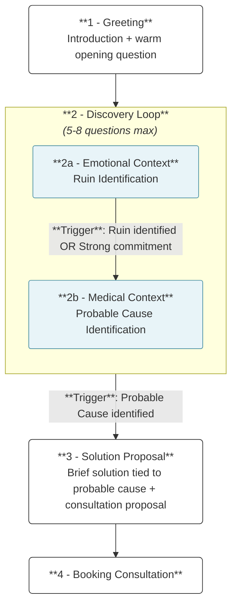
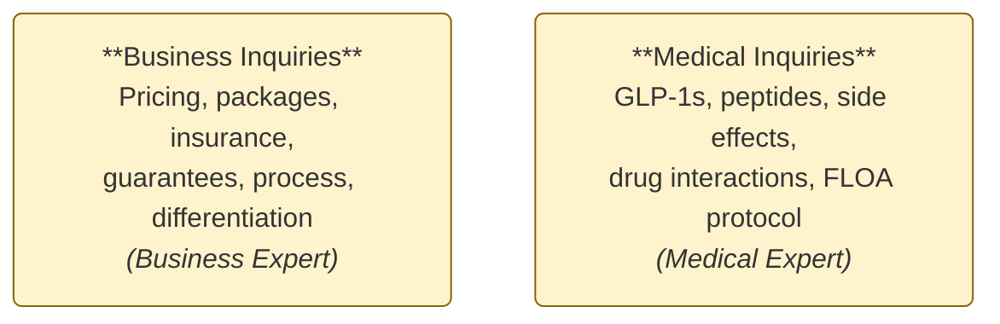
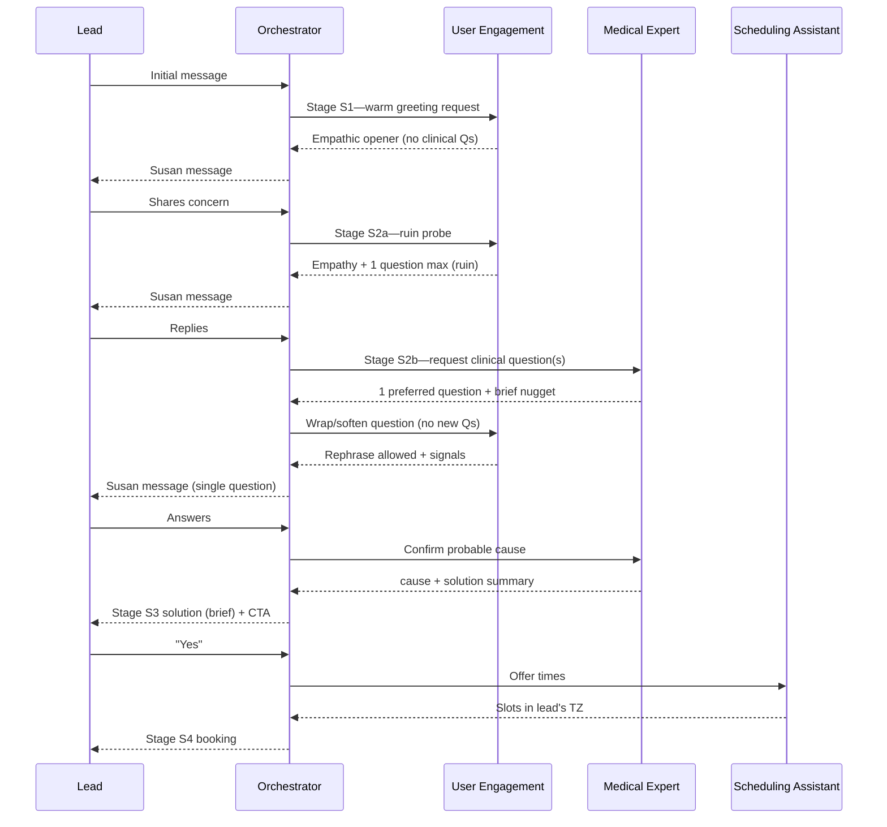

# Main Conversation Guideline

```mermaid
%%{init: {"flowchart": { "subGraphTitleMargin": { "bottom": 20 }}}}%%
flowchart TB
    S1["**1 - Greeting**<br/>Introduction + warm opening question"]

    subgraph S2["**2 - Discovery Loop**<br/><i>(5-8 questions max)</i></br>"]
        direction TB
        S2a["**2a - Emotional Context**<br/>Ruin Identification"]
        S2b["**2b - Medical Context**<br/>Probable Cause Identification"]
        S2a -->|**Trigger**: Ruin identified OR Strong commitment| S2b
    end

    S3["**3 - Solution Proposal**<br/>Brief solution tied to probable cause + consultation proposal"]
    S4["**4 - Booking Consultation**"]

    S1 --> S2
    S2 -->|**Trigger**: Probable Cause identified| S3
    S3 --> S4

    %% Styling
    classDef stage fill:#ffffff,stroke:#333,stroke-width:1px,rx:5px,ry:5px;
    classDef substage fill:#e8f4f8,stroke:#4a90a4,stroke-width:1px,rx:3px,ry:3px;

    class S1,S3,S4 stage;
    class S2a,S2b substage;
```

# "Side" Conversation

```mermaid
flowchart TD
    SC1["**Business Inquiries**<br/>Pricing, packages, insurance,<br/>guarantees, process, differentiation<br/><i>(Business Expert)</i>"]
    SC2["**Medical Inquiries**<br/>GLP-1s, peptides, side effects,<br/>drug interactions, FLOA protocol<br/><i>(Medical Expert)</i>"]

    %% Styling
    classDef sideNode fill:#fff3cd,stroke:#856404,stroke-width:1px,rx:5px,ry:5px;

    class SC1,SC2 sideNode;
```

# Main Sequence Diagram

```mermaid
sequenceDiagram
  participant Lead
  participant Orchestrator
  participant Engage as User Engagement
  participant Med as Medical Expert
  participant Sched as Scheduling Assistant

  Lead->>Orchestrator: Initial message
  Orchestrator->>Engage: Stage S1—warm greeting request
  Engage-->>Orchestrator: Empathic opener (no clinical Qs)
  Orchestrator-->>Lead: Susan message

  Lead->>Orchestrator: Shares concern
  Orchestrator->>Engage: Stage S2a—ruin probe
  Engage-->>Orchestrator: Empathy + 1 question max (ruin)
  Orchestrator-->>Lead: Susan message

  Lead->>Orchestrator: Replies
  Orchestrator->>Med: Stage S2b—request clinical question(s)
  Med-->>Orchestrator: 1 preferred question + brief nugget
  Orchestrator->>Engage: Wrap/soften question (no new Qs)
  Engage-->>Orchestrator: Rephrase allowed + signals
  Orchestrator-->>Lead: Susan message (single question)

  Lead->>Orchestrator: Answers
  Orchestrator->>Med: Confirm probable cause
  Med-->>Orchestrator: cause + solution summary
  Orchestrator-->>Lead: Stage S3 solution (brief) + CTA

  Lead->>Orchestrator: "Yes"
  Orchestrator->>Sched: Offer times
  Sched-->>Orchestrator: Slots in lead's TZ
  Orchestrator-->>Lead: Stage S4 booking
```
